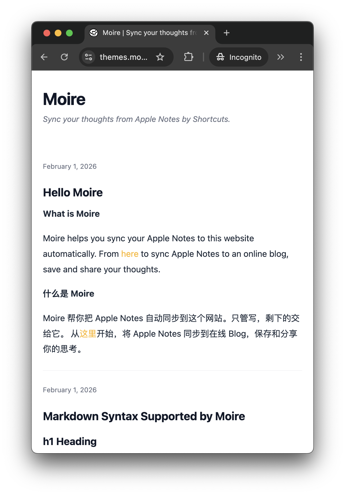
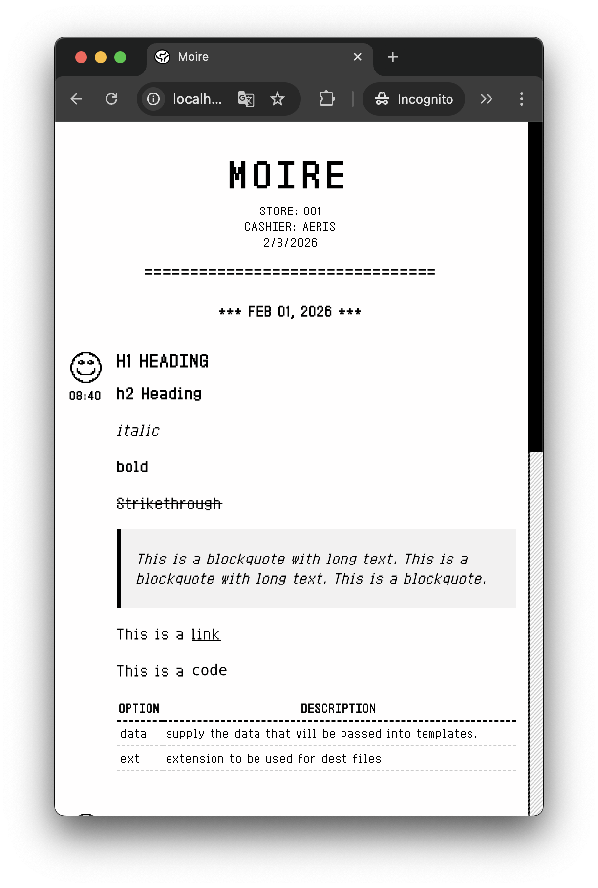
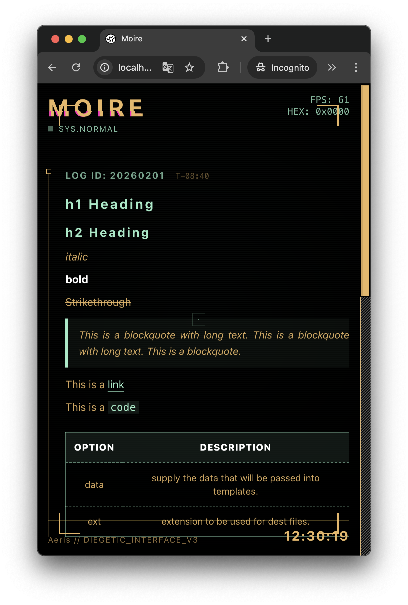
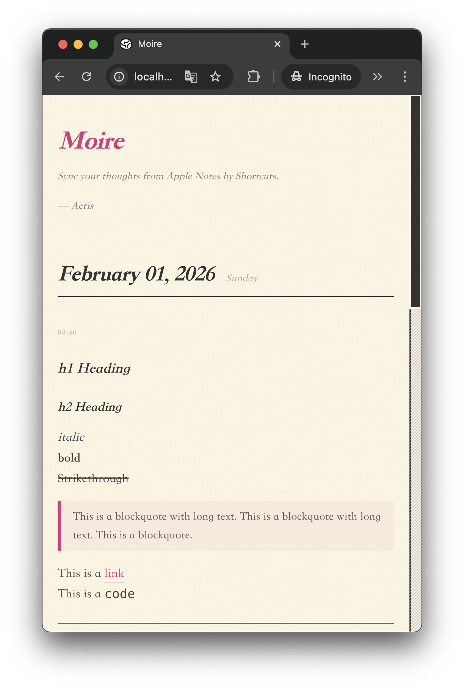
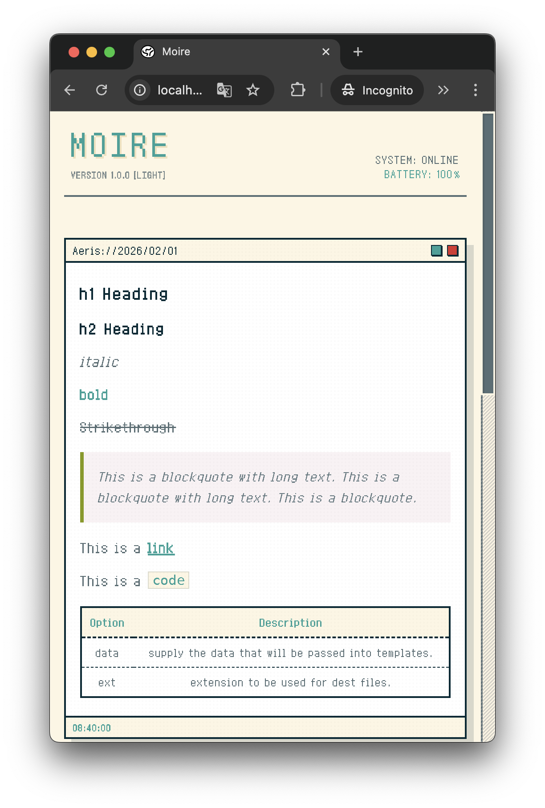
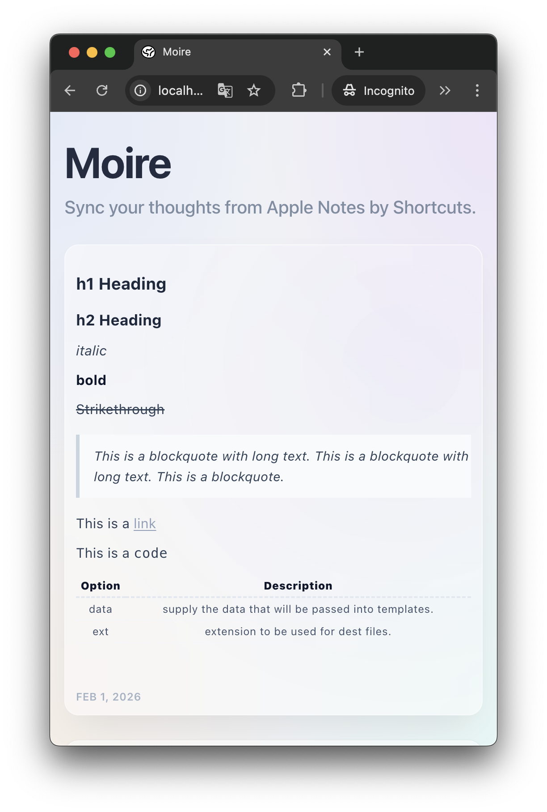

import { Steps } from '@astrojs/starlight/components';

Moire 提供多套精心设计的主题，每个主题都有独特的视觉风格和氛围。你可以访问 [Moire Themes](https://themes.moire.blog) 查看所有主题。

## 可用主题

### Classic（默认）



### Receipt（票据风）

**特点**：
- 🧾 模拟纸质票据的质感
- 📝 单色黑白设计

**预览**：
```typescript
theme: "receipt"
```




---

### Cyberpunk（赛博朋克）

**特点**：
- 💻 黑客终端风格
- ⚡ 动态扫描线效果

**预览**：
```typescript
theme: "cyberpunk"
```



---

### Academic（学术风）

**特点**：
- 🎓 衬线字体
- 📄 正式的笔记本样式

**预览**：
```typescript
theme: "academic"
```



---

### Pixel（像素游戏风）

**特点**：
- 🎮 8-bit 像素艺术
- 🎨 明快色彩

**预览**：
```typescript
theme: "pixel"
```



### Bento（现代风）

- 圆角卡片
- 流动背景

**预览**：
```typescript
theme: "bento"
```




## 如何切换主题

在 `moire.config.ts` 中修改 `theme` 字段：

```typescript
export default {
  title: "My Blog",
  theme: "cyberpunk", // 改成你想要的主题
  // ... 其他配置
}
```

提交到 GitHub，等待构建完成即可。


## 自定义主题（进阶）

如果你了解前端开发或 Vibe Coding，可以创建自己的主题！

主题文件位于：`src/themes/your-theme/`

你需要：

<Steps>

1. 创建 `index.svelte` 组件
2. 定义 CSS 样式
3. 在配置中引用 `your-theme`

</Steps>

详细教程请参考 [开发者文档](https://github.com/moirelog/moire/wiki)。

## 主题路线图

即将推出的主题：

- 🌙 **Midnight** - 深色极简风
- ✍️ **Handwriting** - 手写笔记风

## 下一步

了解 Markdown 和图片上传的支持情况。

import { LinkCard } from '@astrojs/starlight/components';

<LinkCard
  title="Markdown 支持"
  description="查看支持的 Markdown 语法"
  href="/usage/markdown/"
/>
