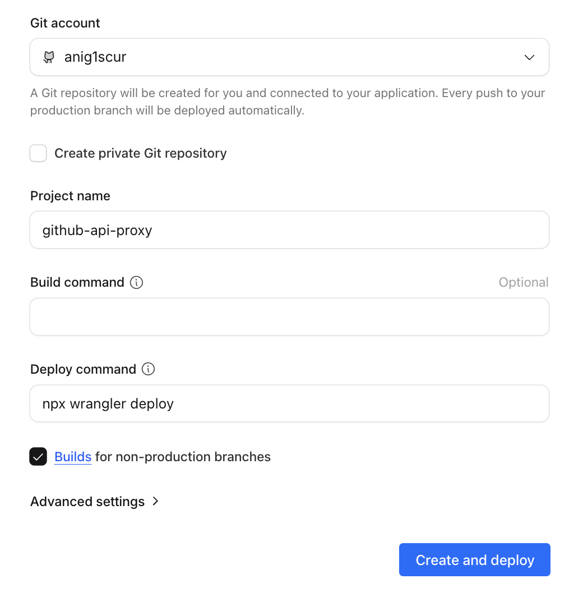
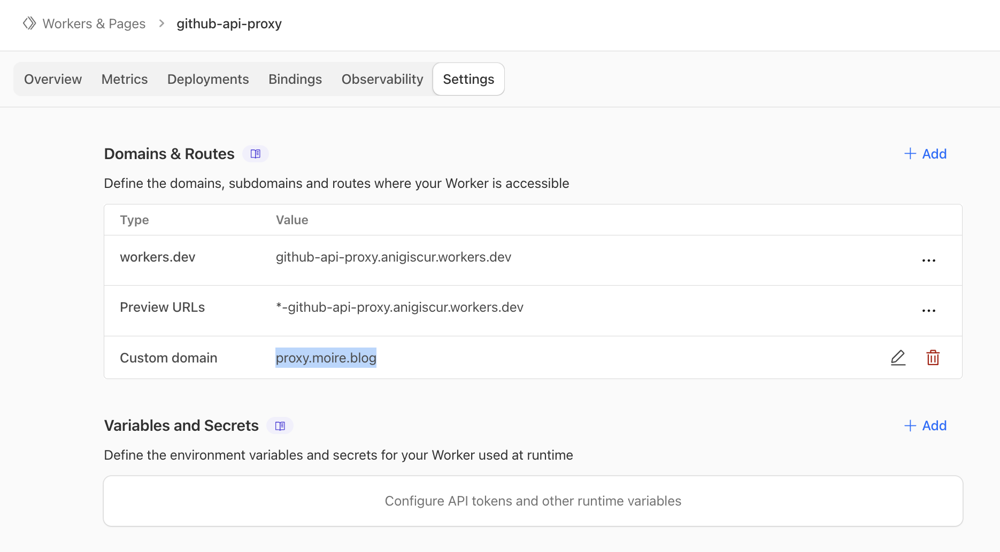

import { Steps, LinkButton } from '@astrojs/starlight/components';

If you are in mainland China, you may experience slow speeds or connection failures when accessing the GitHub API. This chapter describes how to set up a proxy using Cloudflare Workers.

## Why Do You Need a Proxy?

Shortcuts need to call the GitHub API to upload notes, but in some network environments:

- Requests time out
- Speeds are extremely slow

Using a Cloudflare Workers proxy can significantly improve speed and stability.

## Deploy Cloudflare Workers

### Prerequisites

- Cloudflare account (free)
- Your own domain (**Required**, as `workers.dev` domains are also inaccessible in certain regions)
- Domain managed by Cloudflare

We provide a one-click deployment button (based on the standalone repository [github-api-proxy](https://github.com/moirelog/github-api-proxy)):

<LinkButton target="_blank" href="https://deploy.workers.cloudflare.com/?url=https://github.com/moirelog/github-api-proxy" variant="secondary" icon="rocket">
  Deploy to Cloudflare Workers in One Click
</LinkButton>



### Manual Deployment

Alternatively, if you want to customize the code, you can clone the worker repository for manual deployment:

<Steps>

1. Ensure Node.js is installed.
2. Clone the repository and deploy:
   ```bash
   git clone https://github.com/moirelog/github-api-proxy.git
   cd github-api-proxy
   npm install
   npx wrangler deploy
   ```
3. Follow the prompts to log in to your Cloudflare account and confirm the deployment.

</Steps>

### Get Your Worker URL

After a successful deployment, you will receive a URL, such as `https://github-api-proxy.YOUR_DOMAIN.workers.dev`.

### Bind a Custom Domain

<Steps>
1. On the Worker page, click **Settings**.
2. Click **Add** next to the **Domains & Routes** heading.
3. Select **Custom Domain**.
4. Enter your subdomain (e.g., `api.yourdomain.com`).
5. Click **Add Custom Domain**.
</Steps>



Now, your Worker URL is:

```
https://api.yourdomain.com
```

Copy this custom domain URL; you will need it later.

## Configure the Shortcut

Now you need to modify Moire Config to use your proxy.

<Steps>

1. Open the Shortcuts app.

2. Find **Moire Config**.

3. Click the **...** in the top right corner to **Edit**.

4. Find the **proxy** variable (usually near the top).

5. Change the default value `https://api.github.com` to your custom domain URL:
   ```
   https://api.yourdomain.com
   ```

6. Click **Done**.

7. Run **Moire Config** once to save the configuration.

</Steps>

## Test the Proxy

Test it after configuration:

Write a test note in the Moire folder, close Apple Notes or press `^S` to trigger the sync. If it succeeds, the proxy is working correctly.


## Troubleshooting

### Workers Deployment Failed?

- Ensure your Cloudflare account email is verified.
- The free plan has a limit of 100,000 requests per day (completely sufficient for a personal blog).

### Shortcut Still Fails?

- Check if the proxy URL in Moire Config is correctness.
- Ensure the URL does *not* end with an extra `/`.
- **Key**: Ensure you used a custom domain, not the `workers.dev` domain.
- Try accessing the Worker URL in a browser to see if it returns a 404.

## Next Steps

If you want to use a custom domain for your blog.

import { LinkCard } from '@astrojs/starlight/components';

<LinkCard
  title="Custom Domain"
  description="Bind your own domain name"
  href="/en/advanced/custom-domain/"
/>
