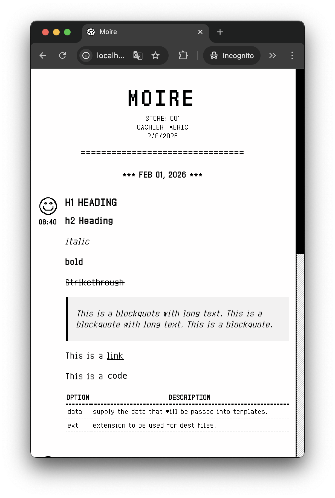
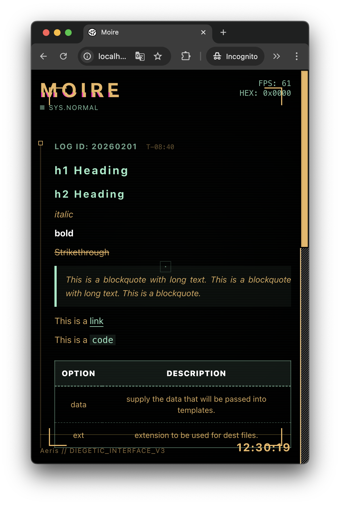
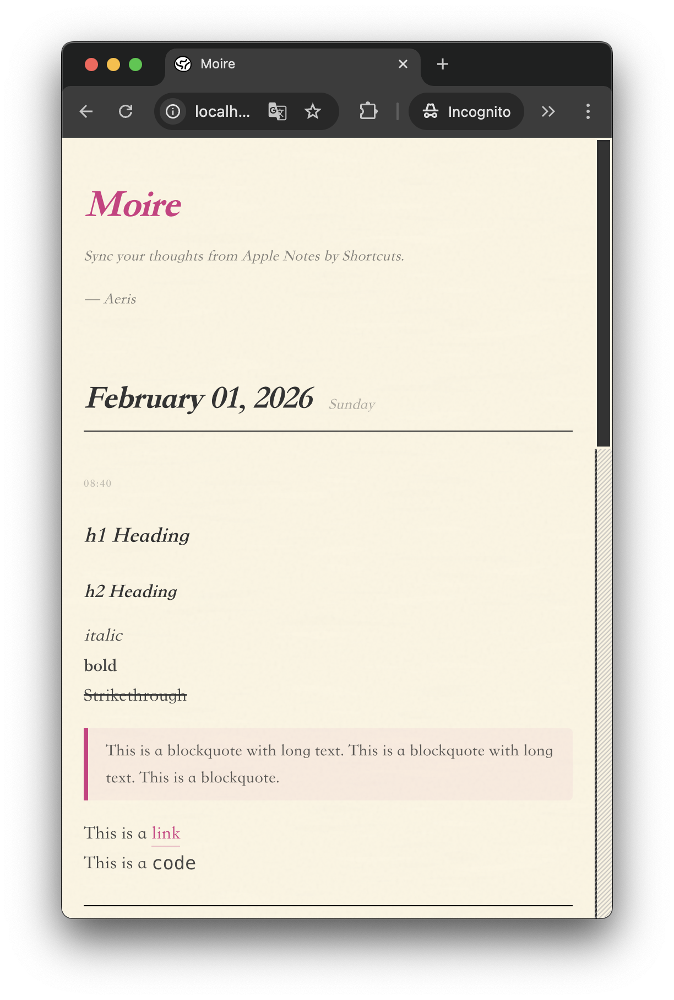
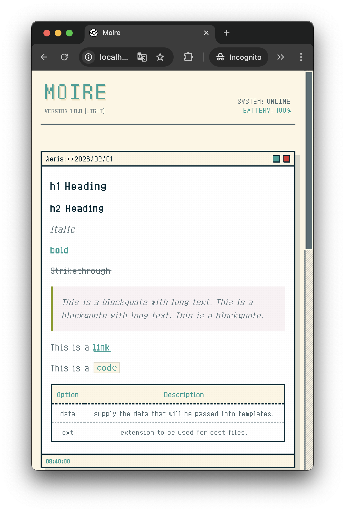

import { Steps } from '@astrojs/starlight/components';

Moire offers several meticulously designed themes, each with its own unique visual style and atmosphere.

## Available Themes

### Receipt (Retro Style)

**Features**:
- 🧾 Simulates the texture of paper receipts
- 📝 Monochrome black and white design

**Preview**:
```typescript
theme: "receipt"
```




---

### Cyberpunk (Hacker Style)

**Features**:
- 💻 Hacker terminal style
- ⚡ Dynamic scanline effects

**Preview**:
```typescript
theme: "cyberpunk"
```



---

### Academic (Formal Style)

**Features**:
- 🎓 Serif fonts
- 📄 Formal notebook layout

**Preview**:
```typescript
theme: "academic"
```



---

### Pixel (Game Style)

**Features**:
- 🎮 8-bit pixel art
- 🎨 Bright colors

**Preview**:
```typescript
theme: "pixel"
```



### Bento (Modern Style)

- Rounded card layout
- Fluid background

**Preview**:
```typescript
theme: "bento"
```


## How to Switch Themes

Modify the `theme` field in `moire.config.ts`:

```typescript
export default {
  title: "My Blog",
  theme: "cyberpunk", // Change to your desired theme
  // ... other configs
}
```

Commit to GitHub and wait for the build to complete.


## Custom Themes (Advanced)

If you're familiar with frontend development or Vibe Coding, you can even create your own theme!

Theme files are located at: `src/themes/your-theme/`

You will need to:

<Steps>

1. Create an `index.svelte` component
2. Define CSS styles
3. Reference `your-theme` in the configuration

</Steps>

Refer to the [Developer Docs](https://github.com/moirelog/moire/wiki) for a detailed tutorial.

## Theme Roadmap

Upcoming themes:

- 🌙 **Midnight** - Minimalist dark mode
- ✍️ **Handwriting** - Handwritten note style

## Next Steps

Learn about Markdown support and image uploads.

import { LinkCard } from '@astrojs/starlight/components';

<LinkCard
  title="Markdown Support"
  description="Check out the supported Markdown syntax"
  href="/en/usage/markdown/"
/>
