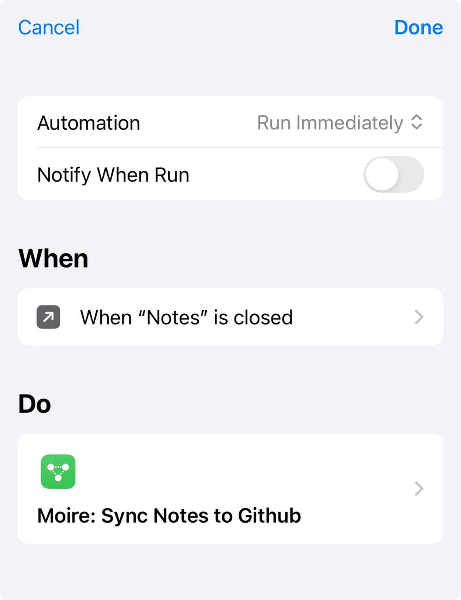
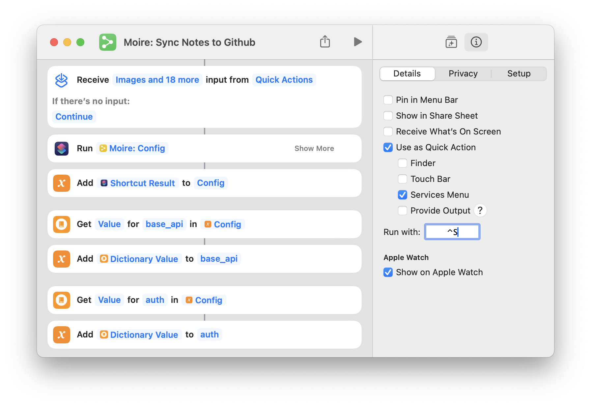

import { Steps, Tabs, TabItem } from '@astrojs/starlight/components';

Once automation is set up, you can automatically trigger Moire Sync when closing Apple Notes or by pressing a keyboard shortcut, without running it manually.

## iOS / iPadOS Automation

<Steps>

1. Open the Shortcuts app.

2. Click the **Automation** tab at the bottom.

3. Click the **+** in the top right corner to create a Personal Automation.

4. Find and select **App** from the list.

5. Click **Choose**, find and select the **Notes** app.

6. Check **Is Closed**.

7. Check **Run Immediately**.

8. Click **Next**.

9. Search for and select **Moire: Sync Notes to Github**.

</Steps>

  

:::tip[Ask Before Running]
If you don't turn off "Ask Before Running," a confirmation dialog will pop up every time you close Notes, defeating the purpose of automation.
:::

## macOS Automation

  <Steps>
  1. Open the Shortcuts app.
  2. Find **Moire: Sync Notes to Github** and right-click to edit.
  3. Select the `ⓘ` icon in the right-hand tab for details.
  4. In **Keyboard Shortcut**, set a key combination, such as `^S`.
  5. Done! Now you can sync by pressing the keyboard shortcut while in Notes.
  </Steps>

  

## Test Automation

Once setup is complete, let's test it:

<Steps>

1. Open the Notes app and go to the **Moire** folder.

2. Create a new note and write some content.

3. Close the Notes app or trigger the keyboard shortcut.

4. You should see the Shortcut icon flash, indicating that it is syncing.

5. After a few minutes, visit your website; you should see the new note.

</Steps>

## About Sync Timing

### When is sync triggered?

#### iOS / iPadOS

- ✅ Lock screen / Exiting or closing the Notes app
- ❌ Switching to another note (will not trigger)

#### macOS

- Keyboard shortcut trigger

### How long does sync take?

| Step | Time |
|------|------|
| Shortcut Upload | 3-5 seconds |
| GitHub Actions Build | 1-2 minutes |
| **Total** | **Approx. 2 minutes** |

:::tip[Please be patient]
Sync is not instantaneous. After closing Notes, wait 2-3 minutes before refreshing your website.
:::

## Congratulations! 🎉

You have now completed the basic configuration for Moire!

You can now:
- Write in Apple Notes
- Trigger automatic sync
- View published content on your website

Next, let's look at how to personalize your site.

import { LinkCard } from '@astrojs/starlight/components';

<LinkCard
  title="Site Configuration"
  description="Edit your site title, author info, and more"
  href="/en/customization/site-config/"
/>
