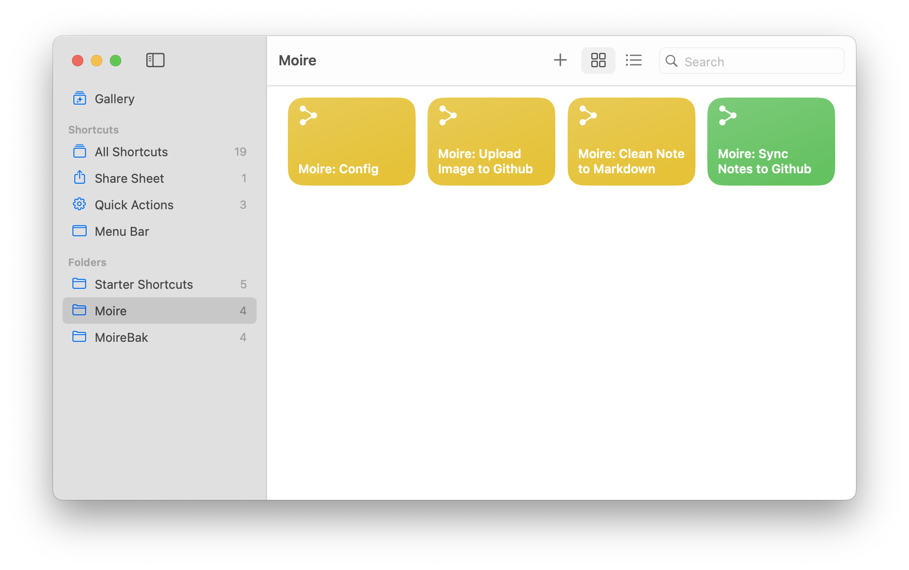

import { Steps, LinkButton, Card } from '@astrojs/starlight/components';

Moire uses four iOS Shortcuts to perform the sync function.

## Download Links

### 1. Moire Config

**Purpose**: Stores your GitHub configuration information (Username, Repository Name, Token).

<LinkButton href="/shortcuts/latest/config" variant="primary" icon="download" target="_blank">
  Download Moire Config
</LinkButton>

### 2. Functional Components

These two Shortcuts handle data conversion and uploading functions.

  <LinkButton href="/shortcuts/latest/upload-image" variant="secondary" icon="download" target="_blank">
    Download Upload Image
  </LinkButton>
  <LinkButton href="/shortcuts/latest/clean-note" variant="secondary" icon="download" target="_blank">
    Download Clean Note
  </LinkButton>

### 3. Moire Sync (Main Entry)

**Purpose**: The main program that syncs note content to GitHub.

<LinkButton href="/shortcuts/latest/sync" variant="secondary" icon="download" target="_blank">
  Download Moire Sync
</LinkButton>

## Installation Steps

<Steps>

1. Download and install the 4 Shortcuts listed above.

2. Done! You should see 4 new Shortcuts in your Shortcuts app.

</Steps>

## Version Information

Current Version: **v1.0.0** (2026-02-07)

:::tip[Check for Updates]
The Shortcuts contain version numbers internally. You can check the comments at the top of the Shortcut to confirm the version.
:::

## Next Steps

Once installation is complete, we need to set up Moire Config.

import { LinkCard } from '@astrojs/starlight/components';

<LinkCard
  title="Fill in Configuration"
  description="Set your GitHub username, repository, and Token"
  href="/en/shortcuts/configuration/"
/>
