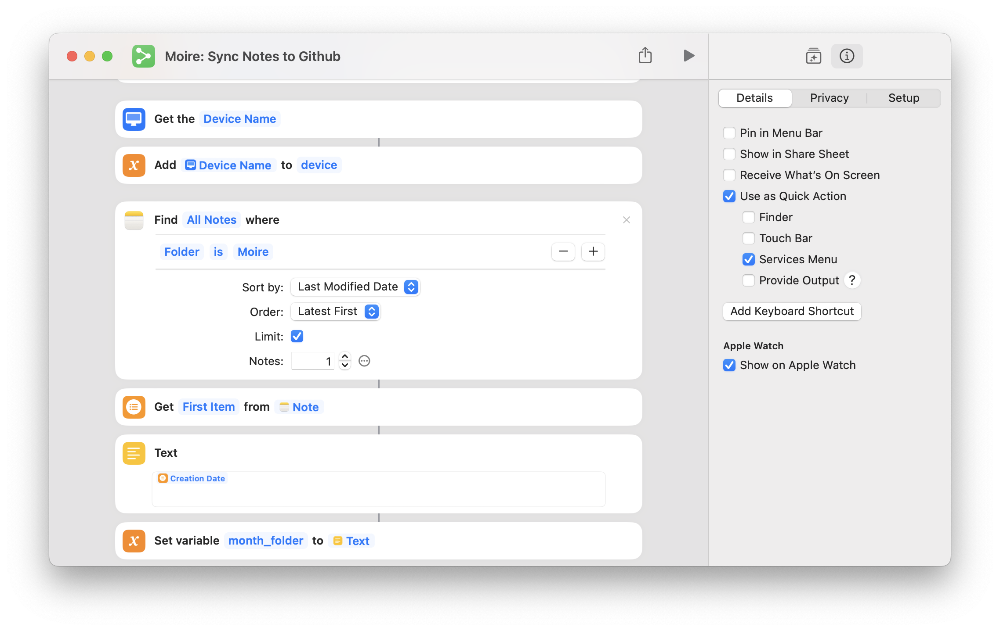
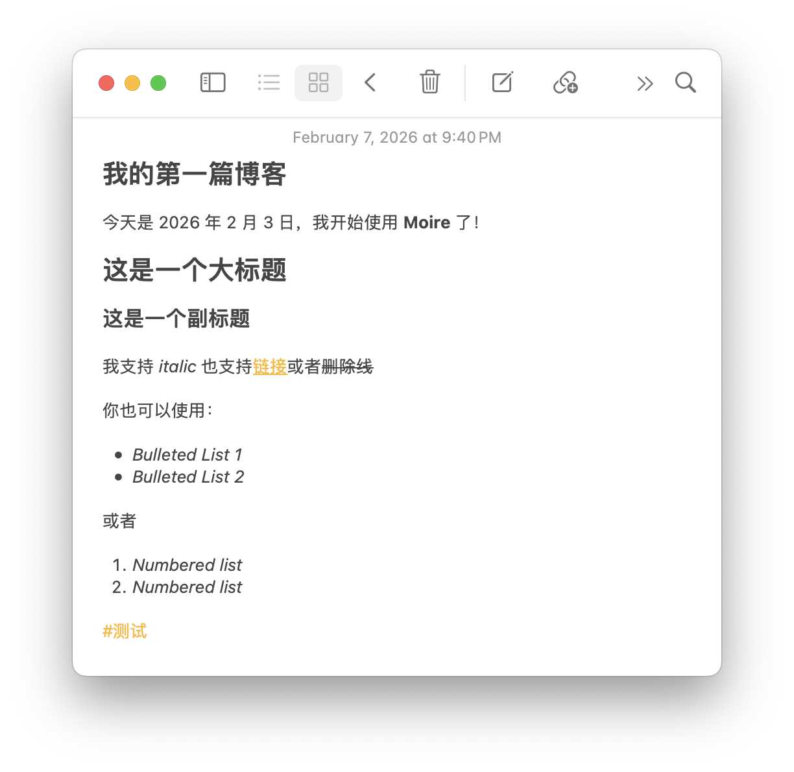

import { Steps } from '@astrojs/starlight/components';

To let Moire know which notes need to be synced, we need to create a dedicated folder in Apple Notes.

## Create the Moire Folder

<Steps>

1. Open the Apple Notes app.

2. Create a new folder under the **iCloud** section.

3. Name the folder **Moire** (or any name you prefer).

4. Done!

</Steps>

:::caution[Important: Binding the Shortcut to the Folder]

Since folder bindings in Shortcuts are stored as UUIDs rather than names, you need to re-bind the folder once.
:::

Please follow these steps:

<Steps>

1. Open the Shortcuts app.
2. Find **Moire: Sync Notes to Github** and right-click to edit.
3. Find the step "Find all notes".
4. Click on "Folder" in the filter criteria and select the folder you just created.

</Steps>



## Why Need a Dedicated Folder?

### Better Organization

A dedicated folder allows you to:
- ✅ Clearly know what content will be made public
- ✅ Better manage blog posts
- ✅ Avoid accidental operations

:::tip[Best Practice]
Only sync content in the **Moire** folder; keep other personal notes private.
:::


## Folder Location

Ensure the Moire folder is under the **iCloud** section, not "On My iPhone".

```
📁 iCloud
  └── 📁 Moire  ← Create it here
  
📁 On My iPhone  ← Not here
```


## Start Creating

Once the folder is created, you can start writing notes in it!

### Writing Tips

- 📝 Use Markdown syntax (bold, italic, links, etc.)
- 🖼️ You can insert images (up to 1 image per note)
- 🏷️ Use `#tags` to categorize content
- ⚠️ Avoid unnecessary spaces at the beginning or end of titles or body text.

### Example Note



## Deleting a Note

To remove a synced note from your blog, simply add `[DEL]` to the note's title and sync again.

For example, change the title from:
```
My First Blog Post
```
to:
```
[DEL] My First Blog Post
```

The note will be removed from your blog on the next sync.

### Accidentally deleted the note locally?
If you deleted the note from Apple Notes before adding the `[DEL]` tag, you can:

<Steps>

1. Find and restore the note from the **Recently Deleted** folder in Apple Notes.
2. Once restored, add `[DEL]` to the title and sync again.
3. If it's no longer in the trash, you'll need to manually delete the corresponding `.md` file in your GitHub repository.

</Steps>

## Sync Only (Private Backup)

If you only want to use Moire to sync and back up your notes without making them public as a blog, follow these steps:

1. **Disable GitHub Pages**: In your GitHub repository's Settings > Pages, set the "Source" under Build and deployment to "None", or remove the deployment workflow.
2. **Set Repository to Private**: In Settings > General > Danger Zone, change the repository's visibility to **Private**.

Since the GitHub Access Token you configured in the Shortcut has permission to access private repositories, the sync functionality will still work perfectly, but your notes will only be visible to you.

## Next Steps

Now that the folder is set up, finally we need to configure automation so your notes sync automatically when you close the app.

import { LinkCard } from '@astrojs/starlight/components';

<LinkCard
  title="Automation"
  description="Set up automatic sync when closing Notes"
  href="/en/shortcuts/automation/"
/>
