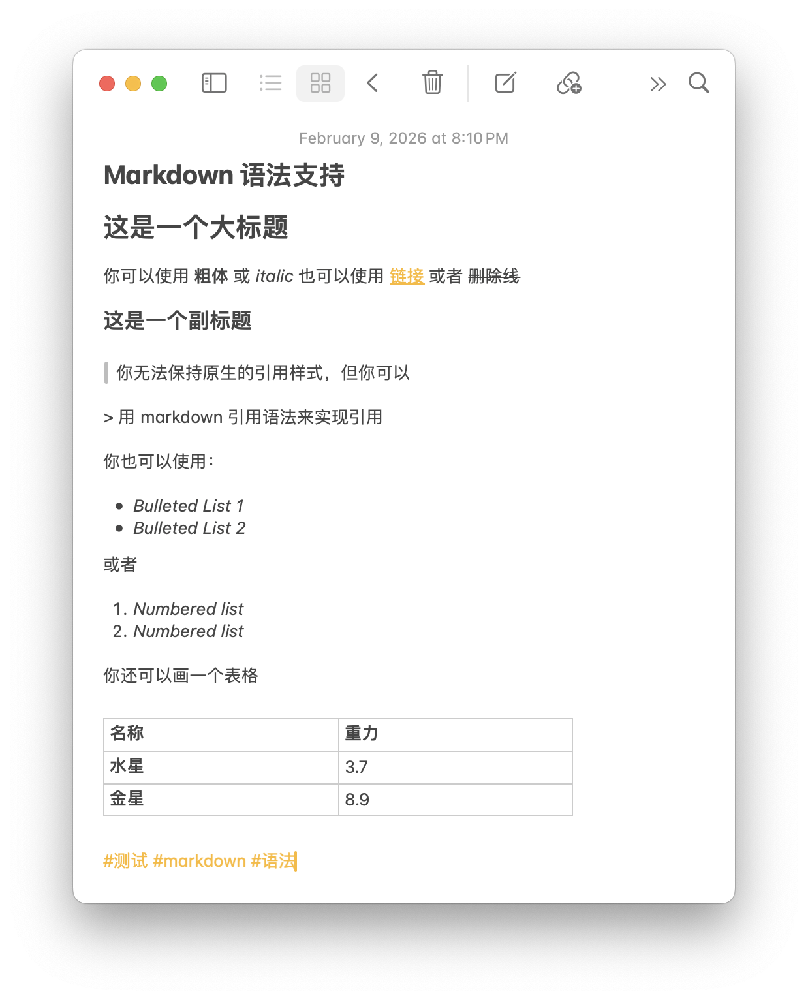

import { Steps } from '@astrojs/starlight/components';

Apple Notes' rich text format is complex. Moire supports converting it to a basic set of Markdown syntax. Here is the feature list.



## Supported Features

### Text Formatting

| Syntax | Result |
|------|------|
| `**Bold**` | **Bold** |
| `*Italic*` | *Italic* |
| `~~Strikethrough~~` | ~~Strikethrough~~ |


### Headings

```markdown
## Level 2 Heading
### Level 3 Heading
```

Only H2 and H3 are supported, corresponding to Notes' `Title` and `Subtitle`. This is because `Subheading` in Notes is actually the same size as the body text and cannot be effectively distinguished.

### Links

```markdown
[Link Text](https://example.com)
```

Result: [Link Text](https://example.com)

### Lists

**Unordered List**:
```markdown
- Item 1
- Item 2
  - Sub-item 2.1
```

**Ordered List**:
```markdown
1. Step One
2. Step Two
3. Step Three
```

### Quotes

````markdown
> This is a quote
> Used to emphasize important content
````

Result:
> This is a quote
> Used to emphasize important content


### Images

```markdown

```

:::note[Image Upload Limitations]
Up to 1 image upload is supported per note. See the [Image Upload Mechanism](/en/usage/images/) for details.
:::

## Best Practices

### 1. Keep It Simple

Use basic Markdown syntax and avoid relying on advanced features.

### 2. Use Lists Wisely

Lists are easier to read than large blocks of text. Benefits:

- Concise and clear
- Easy to scan

### 3. Use Images Appropriately

A picture is worth a thousand words, but don't overdo it (limit 1).

## Next Steps

Learn more about image upload mechanisms and limitations.

import { LinkCard } from '@astrojs/starlight/components';

<LinkCard
  title="Image Upload Mechanism"
  description="Learn how to use images in your notes"
  href="/en/usage/images/"
/>
