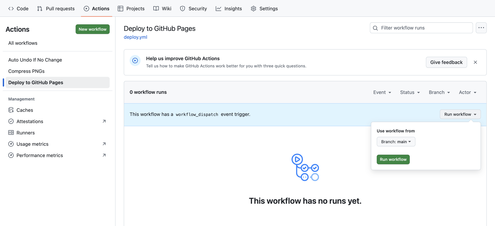

import { Steps } from '@astrojs/starlight/components';

完成前面的步骤后，让我们验证一下网站是否部署成功。

## 手动触发构建

<Steps>

1. 进入你 Fork 的仓库

2. 点击顶部的 **Actions** 标签

3. 在左侧找到 **Deploy to GitHub Pages** 工作流

4. 点击右侧的 **Run workflow** 按钮

5. 选择 `main` 分支，点击绿色的 **Run workflow** 按钮

</Steps>



## 查看构建状态

构建过程通常需要 1-3 分钟。你可以点击正在运行的工作流查看详情。以下是状态说明：

| 状态 | 图标 | 含义 |
|------|------|------|
| In progress | 🟡 | 正在构建 |
| Success | ✅ | 构建成功 |
| Failure | ❌ | 构建失败 |

:::tip[构建成功标志]
当你看到所有步骤都显示绿色 ✅ 时，说明构建成功！
:::

## 访问你的网站

构建成功后，你可以通过以下地址访问网站：

```
https://<YOUR_USERNAME>.github.io/<REPO_NAME>/
```

例如，如果你的 GitHub 用户名是 `aeris`，仓库名是 `moire`：

```
https://aeris.github.io/moire/
```

:::note[首次访问]
首次部署后，可能需要等待几分钟才会生效。如果出现 404 错误，稍等一会儿再试。
:::

## 常见问题

### 构建失败？

如果 Actions 显示红色 ❌：

- 点击失败的工作流查看详细日志
- 检查是否正确开启了 GitHub Actions 权限
- 检查 Build and deployment 的 Source 是否设置为 GitHub Actions

如需帮助，请查看 [故障排除](/troubleshooting/) 章节。

## 恭喜！🎉

如果你能成功访问网站，说明部署已完成！

接下来，我们需要配置 iOS 快捷指令，让你能够从备忘录同步笔记。

import { LinkCard } from '@astrojs/starlight/components';

<LinkCard
  title="下载快捷指令"
  description="安装并配置 Moire Sync 快捷指令"
  href="/shortcuts/downloads/"
/>
