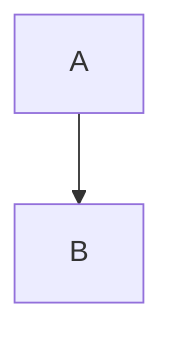

Moire 使用标准 Markdown 语法，以下是支持的功能清单。

## ✅ 已支持

### 文本格式

| 语法 | 效果 | 示例 |
|------|------|------|
| `**粗体**` | **粗体** | `**重要**` |
| `*斜体*` | *斜体* | `*强调*` |
| `~~删除线~~` | ~~删除线~~ | `~~已过时~~` |
| `` `代码` `` | `代码` | `` `console.log()` `` |

### 标题

```markdown
# 一级标题
## 二级标题
### 三级标题
```

支持 H1 到 H6。

### 链接

```markdown
[链接文本](https://example.com)
```

效果：[链接文本](https://example.com)

### 列表

**无序列表**：
```markdown
- 项目 1
- 项目 2
  - 子项目 2.1
```

**有序列表**：
```markdown
1. 第一步
2. 第二步
3. 第三步
```

### 引用

```markdown
> 这是一段引用
> 可以跨多行
```

效果：
> 这是一段引用

### 代码块

````markdown
```javascript
function hello() {
  console.log("Hello Moire!");
}
```
````

### 分隔线

```markdown
---
```

### 图片

```markdown

```

:::note[图片上传限制]
每篇笔记最多支持 1 张图片上传，详见[图片上传机制](/usage/images/)。
:::

## ❌ 暂不支持

以下功能在当前版本**不支持**：

### 表格

```markdown
| 列1 | 列2 |
|-----|-----|
| 内容 | 内容 |
```

:::caution[表格不可用]
备忘录本身不支持表格语法，因此 Moire 也无法处理表格。
:::

### 数学公式

```markdown
$$
E = mc^2
$$
```

TeX/LaTeX 公式暂不支持。

### Mermaid 图表

```markdown

````

流程图、时序图等暂不支持。

### 任务列表

```markdown
- [ ] 未完成
- [x] 已完成
```

Checkbox 暂不支持。

### HTML 标签

直接写 HTML 标签可能不会渲染或被过滤。

## 最佳实践

### 1. 保持简单

使用基础 Markdown 语法，避免依赖高级功能。

### 2. 多用标题

良好的标题层级让文章更易读：

```markdown
# 主标题

## 第一部分

### 小节 1.1

内容...

### 小节 1.2

内容...

## 第二部分
```

### 3. 善用列表

列表比大段文字更易读：

```markdown
优点：
- 简洁
- 清晰
- 易于扫描
```

### 4. 适当配图

一张图胜过千言万语，但不要贪多（限制 1 张）。

## 测试你的 Markdown

不确定效果？试试这个流程：

1. 在 Moire 文件夹写一篇测试笔记
2. 使用你想测试的语法
3. 同步到网站
4. 查看渲染效果

## 未来支持计划

我们计划在未来版本支持：

- 📊 表格渲染
- 🧮 数学公式（KaTeX）
- 📈 Mermaid 图表

关注 [版本日志](/changelog/) 了解最新进展。

## 下一步

了解图片上传的工作机制和限制。

import { LinkCard } from '@astrojs/starlight/components';

<LinkCard
  title="图片上传机制"
  description="了解如何在笔记中使用图片"
  href="/usage/images/"
/>
